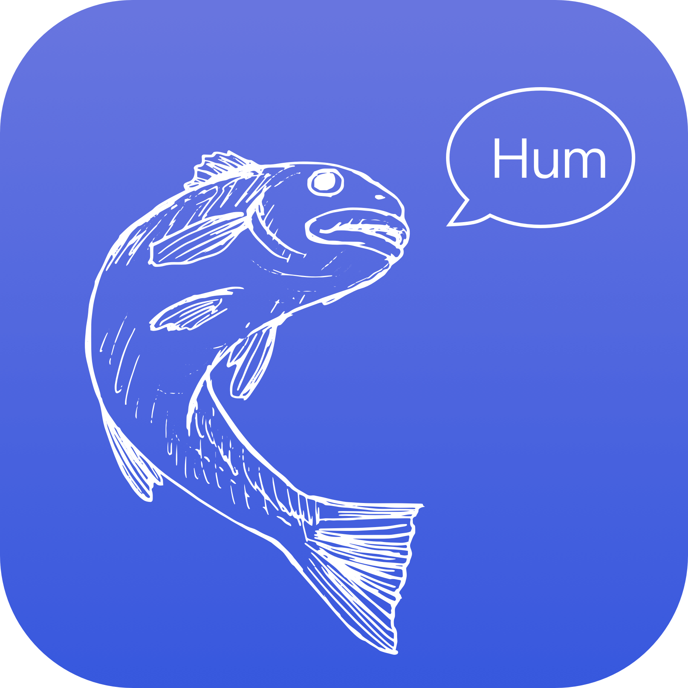
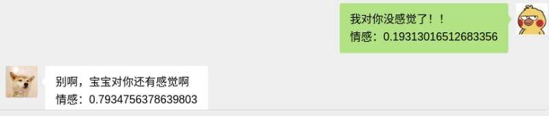
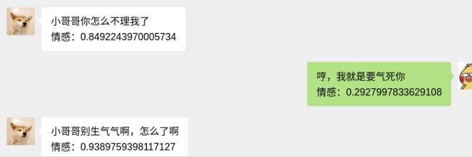

<br />
<p align="center">
  <a href="https://github.com/frontmage/fishpond">
    
  </a>

  <h3 align="center">鱼塘</h3>

  <p align="center">
    基于网页微信的养鱼插件
  </p>
</p>

<!-- TABLE OF CONTENTS -->

## Table of Contents

- [Table of Contents](#table-of-contents)
- [About The Project](#about-the-project)
  - [Built With](#built-with)
- [Getting Started](#getting-started)
  - [Prerequisites](#prerequisites)
- [Roadmap](#roadmap)
- [Contributing](#contributing)
- [License](#license)

<!-- ABOUT THE PROJECT -->

## About The Project




常年被养鱼突然有感而发，为何不把 NLP 技术用于养鱼，通过模型评测每一句聊天，给出对应的情感分析数据

### Built With

- [fastapi](https://fastapi.tiangolo.com/)
- [snownlp](https://pypi.org/project/snownlp/)
- [docker](https://www.docker.com/)

## Getting Started

先要安装[tampermonkey](https://chrome.google.com/webstore/detail/tampermonkey)或者其他类似的工具。

然后把 repo 里的`fishpond.js`丢到用户脚本里面并启用。

然后需要启动 NLP 模型服务器

```bash
clone the repo
cd fishpond_sentiment_analysis
uvicorn main:app --host 0.0.0.0 --log-level debug
```

然后登录网页微信即可使用。

### Prerequisites

- snownlp

```sh
pip install snownlp
```

- fastapi

```sh
pip install fastapi
```

## Roadmap

See the [open issues](https://github.com/frontmage/fishpond/issues) for a list of proposed features (and known issues).

目前得做个看板用来统计各个鱼儿的情感曲线以及平均回复时间，统计这个是想看看塘主有没有什么特征，例如平均回复时间可能>2 小时。

## Contributing

现在模型是用的`snownlp`，它的情感分析是基于商品评价语料库，我们需要真正的养鱼语料库，所以各位塘主和鱼儿们，把自己的聊天贡献出来吧～

在`data/pond/sample.csv`可以参考如何标注自己的聊天记录为 csv，我每周用 bert 训练一发，模型会以 docker 镜像的形式发布。

## License

Distributed under the MIT License. See `LICENSE` for more information.
